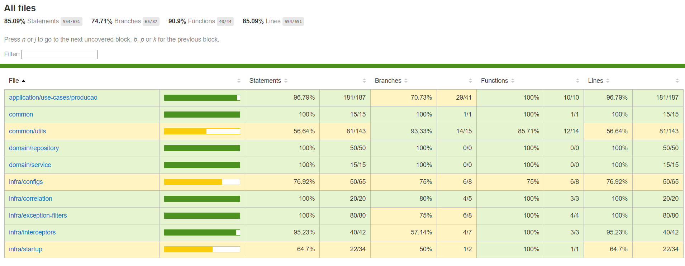

# Tech Challenge FIAP - Grupo 52

## Objetivo
API destinada ao gerenciamento da produção, todo o processo de execução do pedido.

## Execução em um cluster k8s

Para executar a aplicação em um cluster Kubernetes, com o `kubectl` corretamente configurado, execute:

```shell
kubectl apply -f k8s
```

Com isso, a API estará disponível na porta 30001 do Cluster. Se for em um ambiente local com Docker Desktop ou _minikube_,
você pode acessar o endereço http://localhost:30001. Em ambientes de nuvem, substitua `localhost` pelo endereço público do cluster.

## Execução para desenvolvimento

Para executar o projeto em modo de desenvolvimento, copie o arquivo ***.env.example*** para ***.env*** e execute os seguintes comandos:

```shell
yarn install
```
```shell
yarn start:dev
```

Com isso, a API estará disponível na porta 3000 e pode ser acessada pelo endereço http://localhost:3000

## Execução em ambiente Docker

Para executar a aplicação usando Docker, basta executar o seguinte comando:

```shell
docker compose up -d
```

Com isso, a API estará disponível na porta 3333 e pode ser acessada pelo endereço http://localhost:3333

## Execução dos testes

Para executar os testes da aplicação, basta executar o seguinte comando:

```shell
yarn test:ci
```

Com isso, os testes irão rodar e mostra a cobertura de %.


## Documentação

A documentação da aplicação é feita usando Swagger e pode ser acessada no endereço `/swagger` da API.
Para uso em ferramentas fora do navegador, como Postman ou Insomnia, o endereço `/swagger-json` pode ser utilizado.

Sendo assim, se a aplicação estiver de pé localmente em um cluster kubernetes, via _minikube_ ou Docker Desktop, por exemplo, você pode acessar http://localhost:30001/swagger e http://localhost:30001/swagger-json .

Já se estiver utilizando Docker, pode acessar em http://localhost:3333/swagger e http://localhost:3333/swagger-json .

E se estiver utilizando o ambiente de desenvolvimento via `yarn`, basta acessar em http://localhost:3000/swagger e http://localhost:3000/swagger-json .


## Demanda
### Produção
Responsável por operacionalizar o processo de produção do pedido, acompanhando a fila de pedidos (visão da cozinha), atualização de status de cada passo do pedido.


## Padrão SAGA - Coreografada

Foi escolhido o padrão "Coreografada" por priorizar a independência. Mas além disso, nos baseamos em outros pontos da "Coreografada". Que são:


**Consistência de Dados:** A coreografia saga é uma alternativa quando a confirmação em duas fases (2PC) não é viável, caso usando em nosso projeto, utilizamos bancos de dados NoSQL(MongoDB) e SQL(Postgres). Foi a alternativa para manter a consistência dos dados, mesmo com serviços independentes.

**Baixo Acoplamento:** Cada serviço (pedido, pagamento, produção, cardapio) tem suas respectivas responsabilidades, com isso mantemos a independências dos mesmos, evitando um ponto único de falha e facilita a manutenção.

**Simplicidade:** Nesse padrão cada serviço gerencia seus dados, não sendo necessário de um processo de controle central.

**Compensação:** E se algo der errado, todos os serviços participantes da SAGA dão rollback no fluxo, executando ações de compensação. Isso garante que o sistema retorne a um estado consistente.

